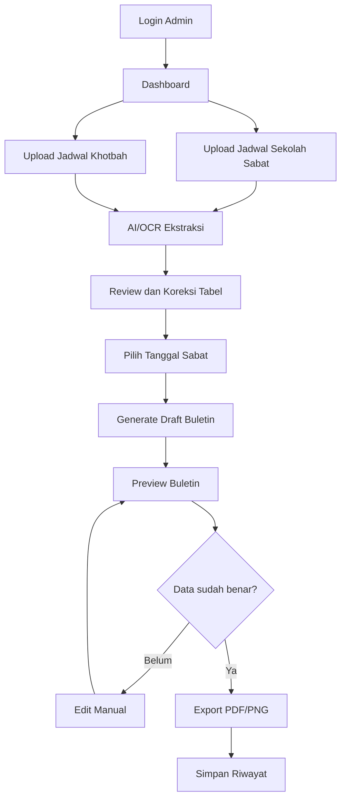

# PRD.md

# Product Requirements Document
## Website Generator Buletin / Susunan Ibadah Sabat GMAHK Tidar 2 Surabaya

**Nama proyek:** Sabbath Bulletin Generator  
**Versi dokumen:** 1.0  
**Target pengguna utama:** Admin gereja, Departemen Sekolah Sabat, Pemimpin Acara, Tim Multimedia/Komunikasi Jemaat  
**Output utama:** Buletin / jadwal susunan Ibadah Sabat otomatis berdasarkan tanggal yang dipilih  
**Format output:** Preview web, PDF siap cetak, PNG/JPG siap dibagikan ke WhatsApp/Instagram  
**Prinsip penting:** AI dipakai untuk membaca, merapikan, dan mencocokkan data jadwal. Desain akhir dibuat dengan template UI yang stabil agar hasil tidak terlihat “AI banget”.

---

## 1. Latar Belakang

Saat ini pembuatan buletin Ibadah Sabat masih dilakukan manual. Tim perlu melihat beberapa sumber jadwal, misalnya:

1. **Jadwal Pelayanan Keraktian Sekolah Sabat**  
   Berisi tanggal, pemimpin, doa buka/tutup, ayat inti, mision, promosi PP/rumah tangga, pembawa persembahan, dan catatan pelayanan.

2. **Jadwal Kebaktian Khotbah**  
   Berisi tanggal, pembicara/khotbah, doa invokasi, ayat bersahutan, doa syafaat, lagu, persembahan, khotbah anak, lagu pujian, komunikasi jemaat, dan bagian-bagian ibadah khotbah lainnya.

3. **Template buletin mingguan**  
   Berisi susunan lengkap mulai dari Ibadah Sekolah Sabat sampai Ibadah Khotbah.

Masalah yang muncul:

- Admin harus mengetik ulang data dari gambar/jadwal.
- Kesalahan nama dan tanggal mudah terjadi.
- Format desain sering tidak konsisten.
- Butuh waktu lama hanya untuk membuat satu buletin mingguan.
- Jika ada perubahan jadwal, admin harus mengedit ulang manual.
- Hasil desain yang dibuat AI secara langsung sering terlihat terlalu “AI”, tidak konsisten, atau salah menulis teks.

Solusi yang dirancang adalah website yang memungkinkan admin mengunggah gambar jadwal Sekolah Sabat dan jadwal Khotbah, memilih tanggal, lalu sistem menghasilkan buletin Ibadah Sabat otomatis dengan desain clean, mewah, konsisten, dan siap pakai.

---

## 2. Product Goal

Membangun website internal gereja untuk mengubah jadwal pelayanan dalam bentuk gambar/tabel menjadi buletin Ibadah Sabat otomatis yang rapi, akurat, mudah diperiksa, dan siap dicetak/dibagikan.

### Tujuan utama

1. Mengurangi pekerjaan manual admin dalam membuat buletin mingguan.
2. Mengambil data pelayanan dari jadwal berdasarkan tanggal yang dipilih.
3. Menggabungkan data dari jadwal Sekolah Sabat dan jadwal Khotbah.
4. Menghasilkan buletin dengan format desain yang konsisten.
5. Memungkinkan admin mengoreksi hasil AI sebelum buletin final dibuat.
6. Menghasilkan file PDF dan PNG berkualitas tinggi.
7. Menyimpan riwayat buletin sehingga dapat digunakan ulang.

### Batasan penting

- Sistem tidak boleh langsung percaya 100% pada hasil AI/OCR.
- Hasil ekstraksi jadwal harus selalu masuk ke tahap **review dan koreksi admin**.
- Final design tidak disarankan dibuat sebagai gambar AI sekali generate, karena risiko teks salah dan tampilan tidak konsisten.
- Desain final sebaiknya berupa **template HTML/CSS atau React component** yang mengisi data secara otomatis.

---

## 3. Target Users

### 3.1 Admin Gereja / Tim Sekretariat

Kebutuhan:

- Upload jadwal pelayanan.
- Pilih tanggal Sabat.
- Generate buletin otomatis.
- Koreksi data jika ada kesalahan.
- Download PDF/PNG.

### 3.2 Departemen Sekolah Sabat

Kebutuhan:

- Melihat jadwal pelayanan per tanggal.
- Memastikan nama petugas benar.
- Menyetujui jadwal sebelum dicetak.

### 3.3 Tim Multimedia / Komunikasi Jemaat

Kebutuhan:

- Mendapatkan file visual yang rapi untuk dibagikan di WhatsApp, layar gereja, atau media sosial.
- Menggunakan format desain yang konsisten setiap minggu.

### 3.4 Gembala Jemaat / Pimpinan Gereja

Kebutuhan:

- Melihat hasil buletin final.
- Memastikan susunan ibadah benar.
- Menyetujui buletin sebelum diedarkan.

---

## 4. Problem Statement

Admin membutuhkan sistem yang dapat membaca jadwal pelayanan dari gambar, mencocokkan data berdasarkan tanggal yang dipilih, lalu membuat buletin Ibadah Sabat secara otomatis tanpa harus mengetik ulang seluruh susunan acara.

Sistem harus tetap memberi ruang koreksi manual supaya akurasi data pelayanan dapat dijaga.

---

## 5. Proposed Solution

Website akan memiliki alur berikut:

1. Admin login.
2. Admin upload gambar jadwal Sekolah Sabat.
3. Admin upload gambar jadwal Khotbah.
4. Sistem melakukan ekstraksi tabel menggunakan OCR/AI vision.
5. Sistem mengubah hasil ekstraksi menjadi data terstruktur.
6. Admin melihat tabel hasil ekstraksi dan memperbaiki jika ada kesalahan.
7. Admin memilih tanggal Sabat.
8. Sistem mengambil baris jadwal sesuai tanggal tersebut dari kedua sumber.
9. Sistem mengisi template buletin dengan data yang sesuai.
10. Admin melihat preview buletin.
11. Admin dapat mengedit bagian tertentu secara manual.
12. Admin export hasil akhir menjadi PDF dan PNG.
13. Sistem menyimpan riwayat buletin.

---

## 6. Scope MVP

MVP adalah versi awal yang cukup untuk digunakan oleh admin gereja secara nyata.

### Fitur wajib MVP

1. Login admin sederhana.
2. Upload dua gambar jadwal:
   - Jadwal Sekolah Sabat.
   - Jadwal Khotbah.
3. Ekstraksi data dari gambar ke tabel.
4. Halaman review dan koreksi data hasil ekstraksi.
5. Pilih tanggal Sabat.
6. Generate buletin otomatis berdasarkan tanggal.
7. Preview buletin.
8. Edit manual sebelum final.
9. Export PDF.
10. Export PNG.
11. Simpan riwayat buletin.

### Fitur tidak wajib untuk MVP

- Multi-cabang gereja.
- Role permission kompleks.
- Mobile app native.
- Approval workflow bertingkat.
- Integrasi WhatsApp otomatis.
- Integrasi Google Calendar.
- Notifikasi otomatis.

---

## 7. Core Features

## 7.1 Authentication

### Deskripsi

Admin harus login sebelum dapat mengunggah jadwal atau membuat buletin.

### Requirement

- Login menggunakan email dan password.
- Register dapat dibatasi hanya untuk admin yang diizinkan.
- Forgot password opsional untuk MVP.
- Session login harus aman.

### Acceptance Criteria

- User tidak login tidak dapat mengakses dashboard.
- User login dapat melihat daftar jadwal dan buletin.
- User dapat logout.

---

## 7.2 Dashboard

### Deskripsi

Dashboard adalah halaman utama setelah login.

### Komponen dashboard

1. Card jumlah jadwal yang sudah diupload.
2. Card jumlah buletin yang sudah dibuat.
3. Tombol upload jadwal baru.
4. Tombol generate buletin baru.
5. Daftar buletin terbaru.
6. Status data: draft, reviewed, generated, exported.

### Acceptance Criteria

- Admin dapat melihat status pekerjaan terbaru.
- Admin dapat masuk ke proses upload jadwal dari dashboard.
- Admin dapat membuka ulang buletin yang pernah dibuat.

---

## 7.3 Upload Jadwal

### Deskripsi

Admin dapat mengunggah gambar jadwal.

### Jenis jadwal

1. **Jadwal Sekolah Sabat**
2. **Jadwal Khotbah**

### Format file yang diterima

- PNG
- JPG/JPEG
- PDF satu halaman atau beberapa halaman

### Requirement

- Setiap upload harus diberi tipe jadwal.
- Sistem menyimpan file asli.
- Sistem membuat preview gambar.
- Sistem menampilkan status proses ekstraksi.

### Acceptance Criteria

- Admin dapat upload gambar jadwal Sekolah Sabat.
- Admin dapat upload gambar jadwal Khotbah.
- Admin dapat melihat file yang sudah diupload.
- Jika file gagal dibaca, sistem menampilkan pesan yang jelas.

---

## 7.4 OCR / AI Extraction

### Deskripsi

Sistem membaca gambar jadwal dan mengubahnya menjadi tabel data.

### Prinsip ekstraksi

- AI harus mengembalikan data dalam format JSON.
- Struktur JSON harus sesuai dengan tipe jadwal.
- Setiap baris harus memiliki tanggal.
- Nama orang harus dipertahankan sebagaimana terlihat di jadwal.
- Jika AI tidak yakin, kolom harus diberi confidence rendah atau catatan.

### Output ekstraksi jadwal Sekolah Sabat

Contoh struktur:

```json
{
  "schedule_type": "sekolah_sabat",
  "period": "Triwulan 3 - 2026",
  "church": "GMAHK Jemaat Tidar 2 Surabaya",
  "rows": [
    {
      "date": "2026-07-04",
      "date_text": "04 Juli 2026",
      "pemimpin_doa_tutup": "Bpk. Tonny Han",
      "doa_buka_ayat_inti": "Bpk. Jonner.P",
      "mision": "Bpk. Joko Sutanto",
      "promosi_pp_rumah_tangga": "Bpk. Agung Wijaya (PP)",
      "pembawa_persembahan": "Bpk. Mulyono & Bpk. Bambang",
      "confidence": 0.92
    }
  ]
}
```

### Output ekstraksi jadwal Khotbah

Contoh struktur yang disarankan:

```json
{
  "schedule_type": "khotbah",
  "period": "Triwulan 3 - 2026",
  "church": "GMAHK Jemaat Tidar 2 Surabaya",
  "rows": [
    {
      "date": "2026-07-04",
      "date_text": "04 Juli 2026",
      "doa_invokasi": "Nama Petugas",
      "ayat_bersahutan": "Nama Petugas",
      "doa_syafaat": "Nama Petugas",
      "persembahan_syukur": "Nama Petugas",
      "khotbah_anak": "Nama Petugas",
      "lagu_pujian_1": "Nama Petugas / Kelompok",
      "lagu_pujian_2": "Nama Petugas / Kelompok",
      "khotbah": "Nama Pembicara",
      "tema_khotbah": "Tema Khotbah",
      "komunikasi_jemaat": "Nama Petugas",
      "confidence": 0.90
    }
  ]
}
```

### Acceptance Criteria

- Sistem dapat menampilkan tabel hasil ekstraksi.
- Tanggal terbaca sebagai format standar `YYYY-MM-DD`.
- Data dapat dikoreksi manual.
- Jika kolom tidak terbaca, sistem menandai sebagai perlu dicek.

---

## 7.5 Review & Correction Table

### Deskripsi

Setelah AI membaca jadwal, admin harus melihat hasilnya dalam bentuk tabel yang bisa diedit.

### Requirement

- Setiap kolom dapat diedit.
- Baris dapat ditambah, dihapus, atau digandakan.
- Data yang confidence-nya rendah diberi tanda warna.
- Admin dapat menyimpan hasil review.
- Data yang sudah direview diberi status `reviewed`.

### Acceptance Criteria

- Admin bisa memperbaiki salah ketik nama.
- Admin bisa memperbaiki tanggal.
- Admin bisa menandai data sebagai sudah benar.

---

## 7.6 Date Selector

### Deskripsi

Admin memilih tanggal Sabat yang ingin dibuatkan buletinnya.

### Requirement

- Sistem menampilkan tanggal yang tersedia dari jadwal.
- Jika tanggal ada di jadwal Sekolah Sabat tetapi tidak ada di jadwal Khotbah, sistem memberi peringatan.
- Jika tanggal ada di jadwal Khotbah tetapi tidak ada di jadwal Sekolah Sabat, sistem memberi peringatan.
- Admin tetap boleh lanjut dengan mengisi data manual.

### Acceptance Criteria

- Admin dapat memilih tanggal tertentu.
- Sistem mengambil data baris yang sesuai dengan tanggal tersebut.
- Sistem tidak mengambil data dari tanggal lain.

---

## 7.7 Bulletin Generator

### Deskripsi

Generator menggabungkan data jadwal ke dalam struktur buletin Ibadah Sabat.

### Struktur buletin

1. Header:
   - Ibadah Sabat
   - Nama gereja
   - Tanggal
2. Petugas awal:
   - Penerima tamu
   - Pianis
   - Pemimpin lagu
   - Pembawa persembahan
3. Ibadah Sekolah Sabat:
   - Lagu Pengantar
   - Pemimpin Acara SS
   - Lagu Pembukaan
   - Ayat & Doa Pembuka
   - Berita Mision
   - Diskusi SS
   - Pelayanan Perorangan
   - Lagu Penutup
   - Doa Penutup
   - Penyambutan Tamu
4. Ibadah Khotbah:
   - Lagu pembuka ibadah
   - Doa invokasi
   - Ayat bersahutan
   - Lagu buka
   - Doa syafaat
   - Persembahan syukur
   - Jemaat memuji
   - Doa persembahan
   - Jemaat menyambut
   - Lagu pujian 1
   - Khotbah anak
   - Lagu pujian 2
   - Scoreboard & Visi Misi
   - Ayat inti
   - Lagu tema
   - Khotbah
   - Tema khotbah
   - Lagu tutup
   - Doa tutup
   - Jemaat menyanyi
   - Komunikasi jemaat

### Mapping dari Jadwal Sekolah Sabat

| Kolom jadwal | Masuk ke bagian buletin |
|---|---|
| Tanggal | Tanggal buletin |
| Pemimpin & Doa Tutup | Pemimpin Acara SS dan Doa Penutup |
| Doa Buka & Ayat Inti | Ayat & Doa Pembuka / Ayat Inti SS |
| Mision | Berita Mision |
| Promosi PP / Rumah Tangga | Pelayanan Perorangan / Promosi |
| Pembawa Persembahan | Pembawa Persembahan |

### Mapping dari Jadwal Khotbah

| Kolom jadwal | Masuk ke bagian buletin |
|---|---|
| Doa Invokasi | Doa Invokasi |
| Ayat Bersahutan | Ayat Bersahutan |
| Doa Syafaat | Doa Syafaat |
| Persembahan Syukur | Persembahan Syukur |
| Khotbah Anak | Khotbah Anak |
| Lagu Pujian 1 | Lagu Pujian 1 |
| Lagu Pujian 2 | Lagu Pujian 2 |
| Khotbah / Pembicara | KHOTBAH |
| Tema Khotbah | Judul tema utama |
| Komunikasi Jemaat | Komunikasi Jemaat |

### Data default yang dapat disimpan sebagai template

Beberapa item biasanya tidak berubah atau bisa dibuat default:

- Lagu Pengantar default.
- Lagu Pembukaan default.
- Lagu Penutup default.
- Lagu jemaat menyambut.
- Footer/tagline gereja.
- Nama gereja.
- Jam ibadah.

Admin harus bisa mengubah data default ini di halaman settings.

---

## 7.8 Bulletin Preview

### Deskripsi

Setelah generate, admin melihat tampilan buletin sebelum export.

### Requirement

- Preview harus sama dengan hasil PDF/PNG.
- Admin dapat edit teks langsung atau melalui form.
- Perubahan langsung terlihat di preview.
- Ada tombol reset ke data jadwal.
- Ada tombol simpan draft.

### Acceptance Criteria

- Admin bisa melihat hasil sebelum download.
- Admin bisa memperbaiki nama, lagu, tema, atau petugas.
- Preview tidak berubah layout saat banyak teks selama masih dalam batas wajar.

---

## 7.9 Export PDF / PNG

### Deskripsi

Sistem mengubah template buletin menjadi file siap pakai.

### Requirement PDF

- Ukuran A4 portrait.
- Resolusi cukup untuk cetak.
- Margin aman.
- Font terbaca.
- Tidak ada teks terpotong.

### Requirement PNG

- Resolusi minimal 1080 x 1530 px.
- Cocok dibagikan ke WhatsApp.
- Tetap terbaca di layar HP.

### Acceptance Criteria

- Admin bisa download PDF.
- Admin bisa download PNG.
- Hasil export sama dengan preview.
- File berhasil dibuka di perangkat umum.

---

## 7.10 Bulletin History

### Deskripsi

Buletin yang sudah dibuat disimpan agar dapat dibuka kembali.

### Requirement

- Daftar buletin berdasarkan tanggal.
- Status: draft, final, exported.
- Bisa duplicate dari buletin sebelumnya.
- Bisa download ulang.

### Acceptance Criteria

- Admin bisa mencari buletin berdasarkan tanggal.
- Admin bisa membuka ulang dan mengedit draft.
- Admin bisa melihat file final yang pernah dibuat.

---

## 8. Recommended User Flow



---

## 9. Page Structure

### 9.1 `/login`

- Form login email/password.
- Error message jika gagal.
- Redirect ke dashboard jika berhasil.

### 9.2 `/dashboard`

- Ringkasan data.
- Tombol upload jadwal.
- Tombol generate buletin.
- Daftar buletin terbaru.

### 9.3 `/schedules`

- Daftar semua jadwal yang diupload.
- Filter berdasarkan tipe jadwal.
- Status ekstraksi.
- Tombol lihat/edit data.

### 9.4 `/schedules/new`

- Upload file.
- Pilih tipe jadwal.
- Jalankan ekstraksi.

### 9.5 `/schedules/[id]/review`

- Tabel hasil OCR.
- Edit data.
- Save as reviewed.

### 9.6 `/bulletins/new`

- Pilih jadwal Sekolah Sabat.
- Pilih jadwal Khotbah.
- Pilih tanggal.
- Generate draft.

### 9.7 `/bulletins/[id]/edit`

- Form data buletin.
- Live preview.
- Save draft.
- Export.

### 9.8 `/bulletins/[id]/preview`

- Tampilan final buletin.
- Tombol export PDF/PNG.

### 9.9 `/settings`

- Nama gereja.
- Logo.
- Lagu default.
- Jam ibadah default.
- Template design default.

---

## 10. Data Model

## 10.1 User

| Field | Type | Description |
|---|---|---|
| id | UUID | Primary key |
| name | string | Nama admin |
| email | string | Email login |
| password_hash | string | Password terenkripsi |
| role | enum | admin, reviewer |
| created_at | datetime | Tanggal dibuat |

## 10.2 ScheduleUpload

| Field | Type | Description |
|---|---|---|
| id | UUID | Primary key |
| type | enum | sekolah_sabat, khotbah |
| title | string | Nama file/jadwal |
| period | string | Contoh: Triwulan 3 - 2026 |
| original_file_url | string | Lokasi file asli |
| extraction_status | enum | pending, processing, success, failed, reviewed |
| extraction_raw_json | json | Hasil asli AI |
| created_by | UUID | User uploader |
| created_at | datetime | Tanggal upload |

## 10.3 ScheduleRowSekolahSabat

| Field | Type | Description |
|---|---|---|
| id | UUID | Primary key |
| schedule_upload_id | UUID | Relasi ke upload |
| date | date | Tanggal Sabat |
| date_text | string | Tanggal asli |
| pemimpin_doa_tutup | string | Pemimpin & doa tutup |
| doa_buka_ayat_inti | string | Doa buka & ayat inti |
| mision | string | Berita mision |
| promosi_pp_rumah_tangga | string | Promosi PP / RT |
| pembawa_persembahan | string | Pembawa persembahan |
| confidence | decimal | Tingkat keyakinan OCR |
| notes | string | Catatan koreksi |

## 10.4 ScheduleRowKhotbah

| Field | Type | Description |
|---|---|---|
| id | UUID | Primary key |
| schedule_upload_id | UUID | Relasi ke upload |
| date | date | Tanggal Sabat |
| date_text | string | Tanggal asli |
| doa_invokasi | string | Petugas doa invokasi |
| ayat_bersahutan | string | Petugas ayat bersahutan |
| lagu_buka | string | Lagu buka |
| doa_syafaat | string | Petugas doa syafaat |
| persembahan_syukur | string | Petugas persembahan syukur |
| jemaat_memuji | string | Lagu jemaat memuji |
| doa_persembahan | string | Petugas doa persembahan |
| jemaat_menyambut | string | Lagu jemaat menyambut |
| lagu_pujian_1 | string | Lagu pujian 1 |
| khotbah_anak | string | Khotbah anak |
| lagu_pujian_2 | string | Lagu pujian 2 |
| scoreboard_visi_misi | string | Petugas scoreboard/visi misi |
| ayat_inti | string | Ayat inti |
| lagu_tema | string | Lagu tema |
| khotbah | string | Pembicara khotbah |
| tema_khotbah | string | Tema khotbah |
| lagu_tutup | string | Lagu tutup |
| doa_tutup | string | Doa tutup |
| komunikasi_jemaat | string | Komunikasi jemaat |
| confidence | decimal | Tingkat keyakinan OCR |
| notes | string | Catatan koreksi |

## 10.5 Bulletin

| Field | Type | Description |
|---|---|---|
| id | UUID | Primary key |
| date | date | Tanggal Sabat |
| title | string | Judul buletin |
| church_name | string | Nama gereja |
| school_sabbath_row_id | UUID | Data Sekolah Sabat |
| sermon_row_id | UUID | Data Khotbah |
| bulletin_data | json | Data final yang sudah diedit |
| status | enum | draft, final, exported |
| pdf_url | string | File PDF final |
| png_url | string | File PNG final |
| created_by | UUID | Admin pembuat |
| created_at | datetime | Tanggal dibuat |
| updated_at | datetime | Terakhir diubah |

---

## 11. API Requirements

### Authentication

| Method | Endpoint | Description |
|---|---|---|
| POST | `/api/auth/login` | Login user |
| POST | `/api/auth/logout` | Logout user |
| GET | `/api/auth/me` | Ambil user aktif |

### Schedule Upload

| Method | Endpoint | Description |
|---|---|---|
| POST | `/api/schedules/upload` | Upload gambar/PDF jadwal |
| POST | `/api/schedules/:id/extract` | Jalankan ekstraksi OCR/AI |
| GET | `/api/schedules` | List jadwal |
| GET | `/api/schedules/:id` | Detail jadwal |
| PATCH | `/api/schedules/:id/rows` | Update hasil koreksi |
| POST | `/api/schedules/:id/mark-reviewed` | Tandai sudah direview |

### Bulletin

| Method | Endpoint | Description |
|---|---|---|
| POST | `/api/bulletins/generate` | Generate draft dari tanggal |
| GET | `/api/bulletins` | List buletin |
| GET | `/api/bulletins/:id` | Detail buletin |
| PATCH | `/api/bulletins/:id` | Edit draft buletin |
| POST | `/api/bulletins/:id/export/pdf` | Export PDF |
| POST | `/api/bulletins/:id/export/png` | Export PNG |

---

## 12. AI System Design

## 12.1 Fungsi AI

AI dipakai untuk:

1. Membaca gambar jadwal.
2. Mengenali struktur tabel.
3. Mengubah hasil baca menjadi JSON.
4. Menandai baris/kolom yang tidak yakin.
5. Membantu normalisasi tanggal.
6. Membantu memberi saran jika data tidak lengkap.

AI **tidak** sebaiknya dipakai untuk membuat desain final dalam bentuk gambar bebas, karena:

- Risiko teks salah.
- Risiko nama berubah.
- Risiko layout tidak konsisten.
- Risiko hasil berbeda setiap generate.
- Sulit diedit secara manual.

Desain final harus dibuat dengan template deterministik: HTML/CSS, React component, atau server-side rendering.

---

## 12.2 OCR Prompt: Jadwal Sekolah Sabat

Gunakan prompt seperti berikut saat membaca gambar jadwal Sekolah Sabat:

```text
Anda adalah sistem ekstraksi tabel untuk jadwal pelayanan gereja.
Baca gambar jadwal Sekolah Sabat yang diberikan.
Ekstrak semua baris tanggal dan kolom pelayanan menjadi JSON valid.
Jangan menebak nama jika tidak jelas.
Jika teks tidak terbaca, isi dengan null dan tambahkan catatan.
Pertahankan ejaan nama sebagaimana terlihat pada gambar.
Normalisasi tanggal ke format YYYY-MM-DD.

Kolom wajib:
- date
- date_text
- pemimpin_doa_tutup
- doa_buka_ayat_inti
- mision
- promosi_pp_rumah_tangga
- pembawa_persembahan
- confidence
- notes

Kembalikan hanya JSON valid tanpa penjelasan tambahan.
```

---

## 12.3 OCR Prompt: Jadwal Khotbah

```text
Anda adalah sistem ekstraksi tabel untuk jadwal kebaktian khotbah gereja.
Baca gambar jadwal yang diberikan.
Ekstrak semua baris berdasarkan tanggal.
Pertahankan nama orang, judul lagu, ayat, dan tema khotbah sesuai gambar.
Jika ada data yang tidak terbaca, isi null dan beri notes.
Normalisasi tanggal ke format YYYY-MM-DD.

Kembalikan JSON valid dengan struktur:
{
  "schedule_type": "khotbah",
  "period": "...",
  "church": "...",
  "rows": [ ... ]
}

Kembalikan hanya JSON valid tanpa penjelasan tambahan.
```

---

## 12.4 Prompt Generator Draft Buletin

```text
Anda adalah assistant penyusun buletin Ibadah Sabat.
Tugas Anda hanya menyusun data, bukan membuat desain gambar.
Gunakan data jadwal Sekolah Sabat dan jadwal Khotbah berikut.
Pilih hanya data dengan tanggal yang sama dengan tanggal_buletin.
Jangan menggunakan data tanggal lain.
Jika ada data kosong, isi dengan "[perlu diisi]".
Pertahankan nama orang sesuai data sumber.
Kembalikan JSON final yang siap dimasukkan ke template buletin.

Input:
- tanggal_buletin
- data_sekolah_sabat
- data_khotbah
- default_template_settings

Output JSON harus berisi:
- header
- petugas_awal
- sekolah_sabat_items
- khotbah_items
- tema_khotbah
- closing_items
- validation_notes
```

---

## 13. Validation Rules

Sistem harus melakukan validasi sebelum buletin dianggap final.

### Validasi tanggal

- Tanggal buletin harus ada di minimal salah satu jadwal.
- Jika tanggal tidak ditemukan, tampilkan error.
- Jika tanggal hanya ada di salah satu jadwal, tampilkan warning.

### Validasi data wajib

Data berikut wajib ada:

- Tanggal buletin.
- Nama gereja.
- Pemimpin Acara SS.
- Doa Penutup SS.
- Berita Mision.
- Pembawa Persembahan.
- Khotbah / Pembicara.
- Tema Khotbah atau placeholder.
- Doa Tutup.
- Komunikasi Jemaat.

### Validasi teks

- Tidak boleh ada teks `null` pada buletin final.
- Placeholder `[perlu diisi]` harus diberi tanda peringatan.
- Nama yang sama tidak perlu dikoreksi otomatis.
- Sistem tidak boleh mengubah ejaan nama tanpa persetujuan admin.

---

## 14. Non-Functional Requirements

## 14.1 Performance

- Upload file maksimal 10 MB untuk MVP.
- Ekstraksi ideal selesai kurang dari 30 detik per gambar.
- Preview buletin harus muncul kurang dari 3 detik setelah data tersedia.

## 14.2 Reliability

- Data jadwal yang sudah dikoreksi tidak boleh tertimpa otomatis oleh AI tanpa konfirmasi.
- Export PDF/PNG harus bisa diulang.
- Jika export gagal, draft tidak boleh hilang.

## 14.3 Security

- File upload harus divalidasi jenis dan ukuran.
- Admin harus login sebelum mengakses data.
- Password harus di-hash.
- File internal gereja tidak boleh public kecuali link export sengaja dibagikan.

## 14.4 Usability

- Admin non-teknis harus bisa menggunakan sistem.
- Setiap proses harus memiliki instruksi singkat.
- Error message harus jelas dan menggunakan bahasa Indonesia.
- Tombol utama harus mudah ditemukan.

## 14.5 Maintainability

- Template desain harus dipisahkan dari logic data.
- Mapping jadwal ke buletin harus mudah diubah.
- Settings default harus dapat diedit tanpa mengubah kode.

---

## 15. Tech Stack Recommendation

### Opsi yang direkomendasikan untuk MVP

- **Frontend:** Next.js + TypeScript
- **Styling:** Tailwind CSS
- **Database:** PostgreSQL
- **ORM:** Prisma
- **Storage:** Supabase Storage atau S3-compatible storage
- **Auth:** NextAuth/Auth.js atau Supabase Auth
- **PDF/PNG Export:** Playwright/Puppeteer render dari HTML template
- **OCR/AI:** AI vision model atau OCR service yang mampu membaca tabel dari gambar
- **Deployment:** Vercel untuk frontend/backend ringan + Supabase untuk database/storage

### Alasan

- Next.js cocok untuk dashboard, API route, dan preview template.
- Tailwind membuat desain konsisten dan cepat.
- PostgreSQL cocok untuk data jadwal tabel.
- Playwright/Puppeteer menjaga hasil PDF/PNG sama dengan preview.
- Template HTML/CSS lebih aman daripada generate gambar AI untuk teks panjang.

---

## 16. Success Metrics

Sistem dianggap berhasil jika:

1. Admin dapat membuat satu buletin lengkap dalam kurang dari 10 menit.
2. Minimal 90% data dari jadwal terbaca benar setelah upload gambar yang jelas.
3. Admin dapat memperbaiki data yang salah tanpa mengulang proses dari awal.
4. Hasil PDF tidak memiliki teks terpotong.
5. Hasil desain konsisten antar minggu.
6. Buletin dapat langsung digunakan untuk cetak atau dibagikan.

---

## 17. Risk & Mitigation

| Risiko | Dampak | Mitigasi |
|---|---|---|
| OCR salah membaca nama | Buletin salah | Wajib review admin |
| Jadwal gambar buram | Data tidak lengkap | Tampilkan confidence dan warning |
| Template penuh karena teks panjang | Layout rusak | Auto font scaling dan overflow check |
| Desain terlihat AI | Kurang profesional | Gunakan template deterministik clean UI |
| Data tanggal tidak cocok | Susunan salah | Validasi tanggal dari dua jadwal |
| Admin lupa koreksi | Kesalahan terbit | Status reviewed wajib sebelum export final |

---

## 18. Final Definition of Done

Sistem MVP selesai jika:

- Admin bisa login.
- Admin bisa upload dua jadwal.
- Sistem bisa mengekstrak data ke tabel.
- Admin bisa koreksi hasil ekstraksi.
- Admin bisa memilih tanggal.
- Sistem bisa generate buletin berdasarkan tanggal yang benar.
- Admin bisa edit draft buletin.
- Admin bisa export PDF dan PNG.
- Desain mengikuti style guide.
- Semua task MVP di `Tasks.md` sudah selesai.
