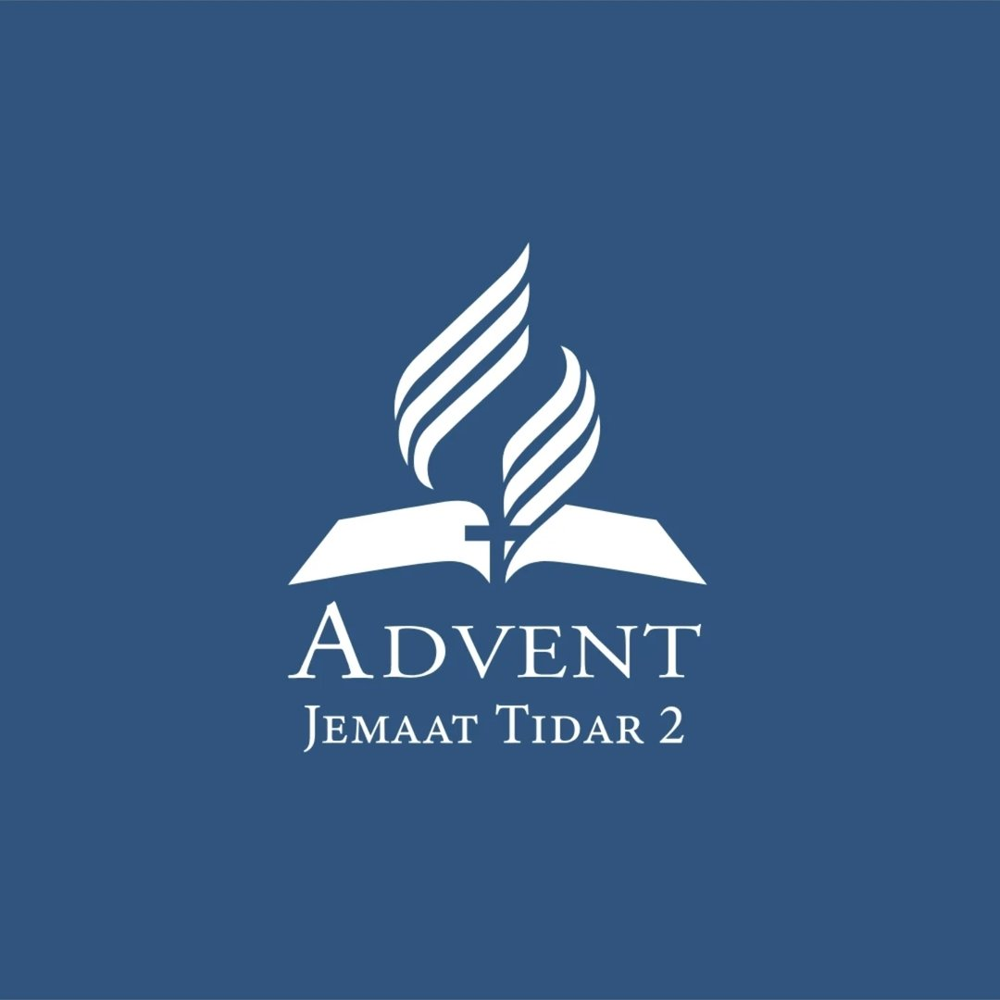
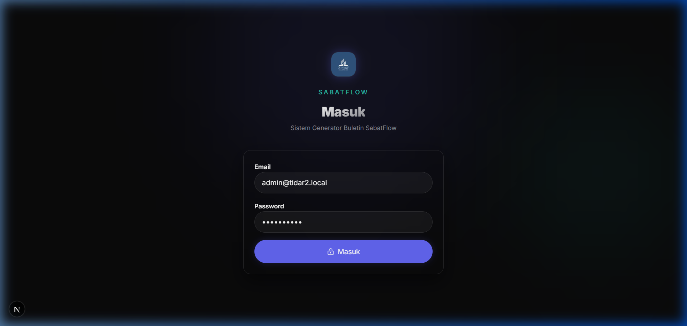
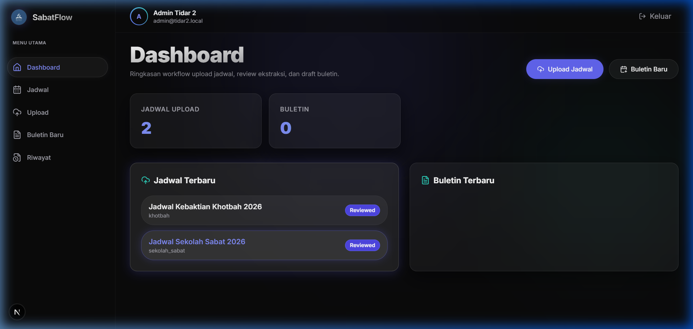
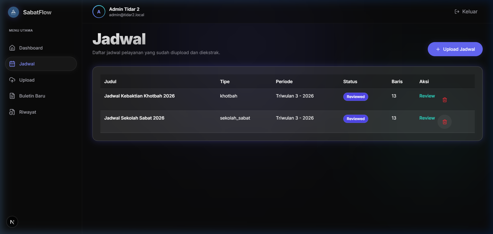

<div align="center">



# ✝️ Buletin GMAHK Tidar 2

### Generator Buletin Ibadah Sabat Digital

<p>
  <strong>GMAHK Jemaat Tidar 2 Surabaya</strong>
</p>

<p>
  
  
  
  
  
</p>

<p>
  
  
  
</p>

<br>

**Transformasi jadwal pelayanan gereja menjadi buletin ibadah sabat yang indah dalam hitungan detik.**

[🚀 Quick Start](#-quick-start) · [✨ Features](#-features) · [📸 Screenshots](#-screenshots) · [🛠 Tech Stack](#-tech-stack) · [📖 Deployment](DEPLOYMENT.md)

---

</div>

## 📖 Tentang

**Buletin GMAHK Tidar 2** adalah sistem generator buletin ibadah sabat digital yang dirancang khusus untuk GMAHK Jemaat Tidar 2 Surabaya. Sistem ini memanfaatkan kecerdasan buatan (AI) untuk mengekstrak data jadwal pelayanan dari gambar dan mengubahnya menjadi buletin yang siap cetak.

<div align="center">


</div>

---

## ✨ Features

<div align="center">

<table>
<tr>
<td width="50%">

### 📤 Upload & Ekstraksi AI
- Upload gambar jadwal (JPG, PNG, WebP)
- Ekstraksi otomatis menggunakan **MiMo AI**
- Mendukung jadwal Sekolah Sabat & Khotbah
- Auto-detect singkatan (RT, PP)
- Default values untuk lagu-lagu

</td>
<td width="50%">

### ✏️ Editor Buletin
- Drag & drop items antar section
- Tambah/hapus item bebas
- Preview real-time A4
- Validasi otomatis
- Simpan draft

</td>
</tr>
<tr>
<td width="50%">

### 📱 Mobile-First Design
- Bottom navigation untuk mobile
- Responsive layout (1/2/4 kolom)
- Touch-friendly (44px target)
- Dark sidebar (desktop)
- Clean & modern UI

</td>
<td width="50%">

### 📄 Export & Print
- Export ke PDF (A4)
- Export ke PNG
- Print-ready styling
- Page break handling
- High quality output

</td>
</tr>
</table>

</div>

---

## 📸 Screenshots

<div align="center">

### 🖥️ Tampilan Aplikasi

| Halaman Login | Dashboard Statistik | Manajemen Jadwal |
|:-----:|:---------:|:------:|
|  |  |  |

*(Fitur Editor Buletin, Preview, Export PDF, dan Tampilan Mobile akan ditambahkan menyusul)*

</div>


---

## 🛠 Tech Stack

<div align="center">

| Category | Technology | Description |
|:--------:|:----------:|:-----------:|
| 🖥️ **Framework** | Next.js 16 | App Router, Server Components |
| 📝 **Language** | TypeScript 5 | Type-safe development |
| 🎨 **Styling** | Tailwind CSS 4 | Utility-first CSS |
| 🗄️ **Database** | Prisma 7 + SQLite | Type-safe ORM |
| 🤖 **AI** | MiMo API | Xiaomi AI for extraction |
| 🔐 **Auth** | Cookie JWT | Secure authentication |
| 📄 **Export** | Playwright | PDF/PNG generation |
| 🧪 **Testing** | Vitest | Unit testing |

</div>

---

## 🚀 Quick Start

### Prerequisites

- Node.js 18+ 
- npm 9+
- MiMo API Key ([Daftar Gratis](https://platform.xiaomimimo.com))

### Installation

```bash
# 1. Clone repository
git clone https://github.com/Renoslendra/buletin-TIDAR2.git
cd buletin-TIDAR2

# 2. Install dependencies
npm install

# 3. Setup environment
cp .env.example .env.local

# 4. Edit .env.local dengan API key Anda
# (lihat .env.example untuk referensi)

# 5. Setup database
npx prisma db push
npx prisma generate
npm run db:seed

# 6. Install Playwright (untuk export)
npx playwright install chromium

# 7. Jalankan aplikasi
npm run dev
```

---

## ⚙️ Environment Variables

```env
# 🗄️ Database
DATABASE_URL="file:./dev.db"

# 🔐 Session
SESSION_SECRET="your-secret-key-min-32-chars"

# 🤖 AI Provider (MiMo - Recommended)
AI_PROVIDER=mimo
MIMO_API_KEY=your-mimo-api-key
MIMO_MODEL=mimo-v2.5
MIMO_BASE_URL=https://api.xiaomimimo.com/v1

# 🌐 App
APP_BASE_URL=http://localhost:3000
```

<details>
<summary>📌 Lihat semua environment variables</summary>

```env
# Database
DATABASE_URL="file:./dev.db"

# Session Secret (min 32 characters)
SESSION_SECRET="your-super-secret-key-here"

# AI Provider: "mimo" | "gemini" | "mock"
AI_PROVIDER=mimo

# MiMo API (Recommended)
MIMO_API_KEY=sk-xxxx
MIMO_MODEL=mimo-v2.5
MIMO_BASE_URL=https://api.xiaomimimo.com/v1

# Gemini API (Alternative)
# AI_PROVIDER=gemini
# GEMINI_API_KEY=xxxx

# App URL
APP_BASE_URL=http://localhost:3000
```

</details>

---

## 📁 Project Structure

```
buletin-TIDAR2/
├── 📂 src/
│   ├── 📂 app/                    # Pages & API Routes
│   │   ├── 📂 api/               # REST API endpoints
│   │   │   ├── 📂 auth/          # Login, logout, me
│   │   │   ├── 📂 bulletins/     # CRUD + export
│   │   │   └── 📂 schedules/     # CRUD + extract
│   │   ├── 📂 dashboard/         # Dashboard page
│   │   ├── 📂 schedules/         # Jadwal pages
│   │   ├── 📂 bulletins/         # Buletin pages
│   │   ├── 📂 history/           # Riwayat page
│   │   └── 📂 login/             # Login page
│   │
│   ├── 📂 components/            # React Components
│   │   ├── 📂 auth/              # Login form
│   │   ├── 📂 bulletin/          # Template & preview
│   │   ├── 📂 editor/            # Buletin editor
│   │   ├── 📂 layout/            # Shell, sidebar, nav
│   │   ├── 📂 schedules/         # Upload & review
│   │   └── 📂 ui/                # Design system
│   │
│   ├── 📂 lib/                   # Utilities
│   │   ├── 📂 ai/                # AI providers
│   │   ├── 📂 auth/              # JWT auth
│   │   ├── 📂 date/              # Date helpers
│   │   ├── 📂 db/                # Prisma client
│   │   ├── 📂 mapping/           # Data mapping
│   │   ├── 📂 storage/           # File storage
│   │   ├── 📂 text/              # Text utils
│   │   └── 📂 validation/        # Zod schemas
│   │
│   ├── 📂 styles/                # CSS files
│   └── 📂 types/                 # TypeScript types
│
├── 📂 prisma/                    # Database
│   ├── schema.prisma             # DB schema
│   └── seed.ts                   # Seed data
│
├── 📂 public/                    # Static assets
│   ├── 📂 logos/                 # Church logos
│   └── 📂 bulletin-reference/    # Reference images
│
├── 📄 DESIGN.md                  # Design system
├── 📄 README.md                  # This file
└── 📄 package.json               # Dependencies
```

---

## 🎯 Commands

```bash
# Development
npm run dev              # Start dev server (http://localhost:3000)
npm run build            # Production build
npm run start            # Start production server

# Testing
npm run test             # Run unit tests
npm run typecheck        # TypeScript checking
npm run lint             # ESLint checking

# Database
npm run db:seed          # Seed database with sample data
npx prisma db push       # Push schema changes
npx prisma generate      # Generate Prisma client
npx prisma studio        # Open Prisma Studio (GUI)
```

---

## 🤖 AI Provider Setup

### MiMo AI (Recommended ⭐)

<div align="center">

| Feature | MiMo | Gemini |
|:-------:|:----:|:------:|
| Bahasa Indonesia | ✅ Excellent | ✅ Good |
| Ekstraksi Tabel | ✅ Excellent | ✅ Good |
| Harga | 💰 Gratis (limited) | 💰 Gratis (limited) |
| Kecepatan | ⚡ Cepat | ⚡ Cepat |

</div>

**Setup:**
1. Daftar di [platform.xiaomimimo.com](https://platform.xiaomimimo.com)
2. Buat API Key
3. Set di `.env.local`:
   ```env
   AI_PROVIDER=mimo
   MIMO_API_KEY=sk-xxxx
   ```

### Gemini AI (Alternative)

1. Dapatkan key di [aistudio.google.com](https://aistudio.google.com/apikey)
2. Set di `.env.local`:
   ```env
   AI_PROVIDER=gemini
   GEMINI_API_KEY=xxxx
   ```

---

## 📱 Mobile Features

<div align="center">

| Feature | Description |
|:-------:|:-----------:|
| 📱 Bottom Navigation | Quick access ke halaman utama |
| 👆 Touch Target 44px | Semua tombol mudah ditekan |
| 📋 Card Layout | Tabel berubah jadi card di mobile |
| 📐 Single Column | Layout optimal untuk layar kecil |
| 🎨 Responsive Grid | 1/2/4 kolom sesuai ukuran layar |

</div>

---

## 🎨 Design System

Warna utama aplikasi:

<div align="center">

| Warna | Hex | Penggunaan |
|:-----:|:---:|:----------:|
| 🟢 Primary | `#1B4D3E` | Header, nav, button |
| 🟡 Accent | `#D4A853` | Highlight, CTA |
| ⚪ Surface | `#FEFCF7` | Background |
| 🔵 Info | `#1B6D3E` | Success state |
| 🔴 Error | `#BA1A1A` | Error state |

</div>

Lihat [`DESIGN.md`](DESIGN.md) untuk panduan lengkap.

---

## 🧪 Testing

```bash
# Run all tests
npm run test

# Run with coverage
npm run test -- --coverage

# Run specific test
npm run test -- bulletin-mapper
```

---

---

## 🤝 Contributing

1. Fork repository
2. Create feature branch (`git checkout -b feature/amazing-feature`)
3. Commit changes (`git commit -m 'Add amazing feature'`)
4. Push to branch (`git push origin feature/amazing-feature`)
5. Open Pull Request

---

## 📄 License

<div align="center">

**Private** - GMAHK Jemaat Tidar 2 Surabaya

Hak cipta dilindungi undang-undang.

</div>

---

## 🙏 Acknowledgments

- [Xiaomi MiMo](https://mimo.xiaomi.com) - AI Provider
- [Next.js](https://nextjs.org) - Framework
- [Tailwind CSS](https://tailwindcss.com) - Styling
- [Prisma](https://prisma.io) - Database ORM
- [Lucide](https://lucide.dev) - Icons

---

<div align="center">

### ✝️ Soli Deo Gloria ✝️

**GMAHK Jemaat Tidar 2 Surabaya**

Jl. Tidar No. 2, Surabaya, Jawa Timur

---

<p>
  
  
</p>

</div>
